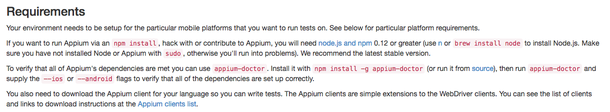
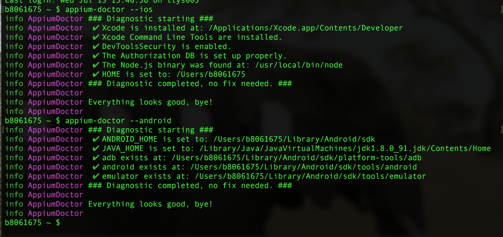
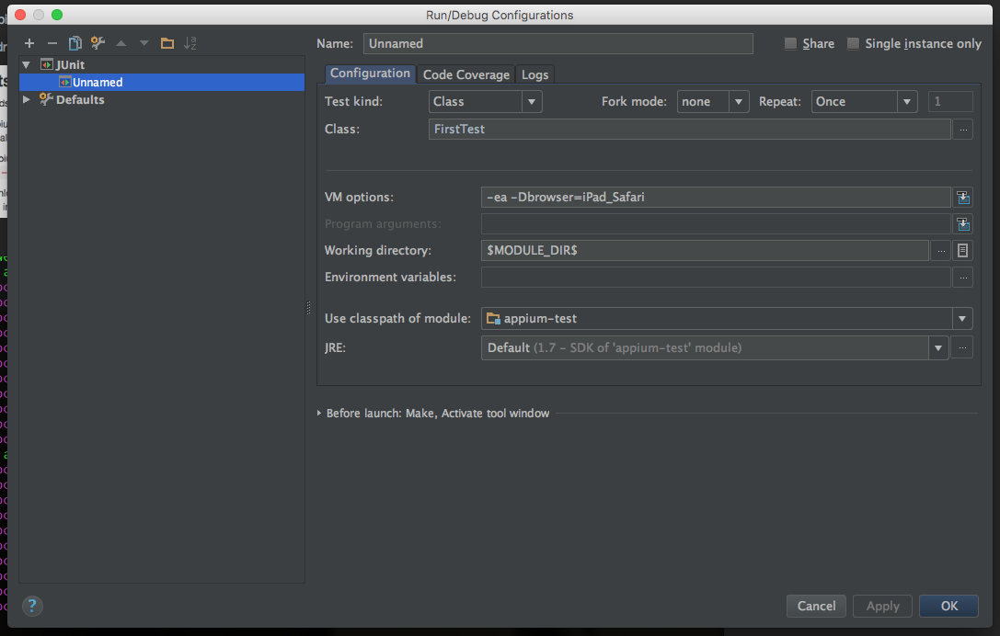

# Getting Setup and general info

Key things to know...

Have a look at my POM.xml file - I have added the following appium java client:

        <dependency>
            <groupId>io.appium</groupId>
            <artifactId>java-client</artifactId>
            <version>4.0.0</version>
            <exclusions>
                <exclusion>
                    <groupId>org.seleniumhq.selenium</groupId>
                    <artifactId>selenium-java</artifactId>
                </exclusion>
            </exclusions>
        </dependency>

The reason there is an exclusion is because there is some sort of incompatibility with Selenium 2.53.0 (at the time of writing) - see here https://github.com/appium/java-client/blob/master/docs/Installing-the-project.md

### Installing appium

In order to run my tests I installed appium on my machine (manually) and then made sure it was up and running.

You can also install via node, as per below instructions at http://appium.io/

- brew install node      # get node.js
- npm install -g appium  # get appium
- npm install wd         # get appium client
- appium &               # start appium
- node your-appium-test.js

### Running the tests

First of all, run appium-doctor to check that everything is set up correctly...

NOTE - to get Android stuff set up, have a look at the readme in cfto_test (All instructions are in there e.g. setting ANDROID_HOME in bash_profile etc
 


And...



If all is ok, make sure that appium is actually up and running!!! To do this, either launch manually via the app OR do appium & in the terminal (to start the application)...

Once that's done, with maven, simply do a:

```sh
mvn clean test -Dbrowser=iPhone6_Safari
```

To run in junit with debug, configure my junit settings in IntelliJ to the following:



And then simply add a debug point and run! :-)


### TODO

Get an Android device up and running